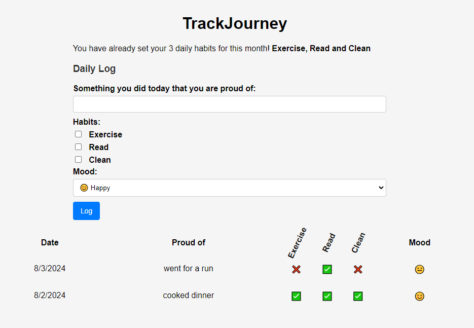

# TrackJourney

## Project Description
TrackJourney is an educational project designed to help me learn and understand Express.js. It is a daily logging application that allows users to write down a sentence about something they did that day they are proud of. Users can also track their habits (e.g., exercise, read, clean) and log their mood using an emoji. The application helps users enforce habits by locking them for a month, meaning they cannot remove them until the month is over.



## Features
- Daily logging of proud moments.
- Habit tracking with three customizable habits.
- Mood tracking using emojis.
- Monthly habit lock to enforce consistency.
- Responsive design for mobile, tablet, and desktop views.

## Installation Instructions
To set up TrackJourney locally, follow these steps:

1. **Clone the repository**:
    ```sh
    git clone https://github.com/teodortodorovt/trackjourney.git
    cd trackjourney
    ```

2. **Install dependencies**:
    ```sh
    npm install
    ```

3. **Start the server**:
    ```sh
    npm start
    ```

4. **For Development**:
    ```sh
    npm run dev
    ```

## Usage Instructions
1. **Access the application**:
    Open your browser and navigate to `http://localhost:3000` to access the TrackJourney application.

2. **Logging Daily Activity**:
    - On the home page, write a sentence about something you are proud of for the day.
    - Select your habits and log your mood using the provided options.

3. **Tracking Habits**:
    - Set your habits at the beginning of the month. These habits will be locked for the month to ensure consistency.

## Technologies Used
- Node.js
- Express.js
- Handlebars

## Contributing
Contributions are welcome! Please follow these steps to contribute:

1. Fork the repository.
2. Create a new branch (`git checkout -b feature/your-feature`).
3. Make your changes.
4. Commit your changes (`git commit -m 'Add some feature'`).
5. Push to the branch (`git push origin feature/your-feature`).
6. Open a Pull Request.
